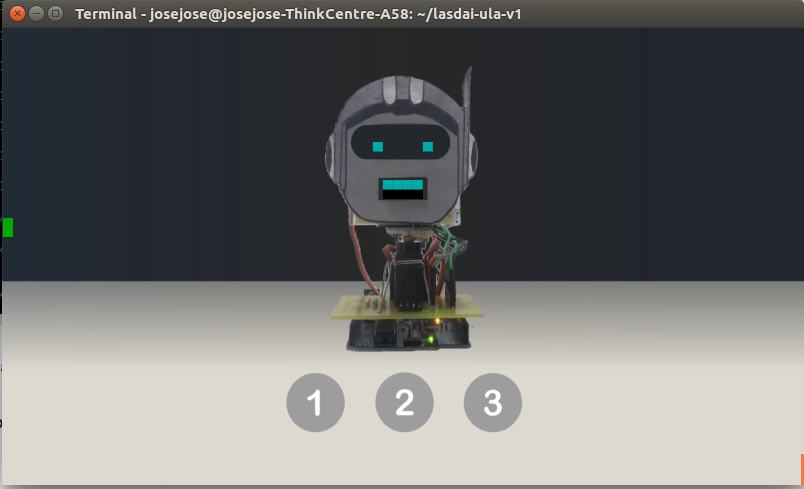

# LRS1
**Simulador LaSDAI Robot Social 1 (LRS1) - un robot social de bajo costo**

MVP del simulador LRS1 construido en la ***terminal Xfce*** de Linux  tiene como finalidad motivar el aprendizaje de la asignatura programación 1 mediante la programación del simulador. 

> Ver articulo relacionado [(Perez, J y Castro, J, 2018)](https://www.researchgate.net/publication/329116387_LRS1_UN_ROBOT_SOCIAL_DE_BAJO_COSTO_PARA_LA_ASIGNATURA_PROGRAMACION_1).

## Instalación
**1.** Modificar la linea del archivo **Makefile** de acuerdo al sistema operativo:

- Linux 32bits:
```sh
 biblioteca = 32bits
```
-   Linux 64bits:
```sh
 biblioteca = 64bits
```
**2.** Compilar y ejecutar el archivo **instalar** para descargar: *espeak*, *mplayer* y *xfce4-terminal*
```sh
$ make instalar
$ sudo make ./instalar
$ rm instalar
```
## Ejecutar el simulador
-   Abrir la **terminal xfce4**
-   Acceder a la carpeta que contiene el archivo **Makefile**
-   Ejecutar las siguientes lineas de comando
```sh
$ make LRS1-V1 ejemplo1
$ ./LRS1-V1
```
-   Abrir otra **terminal linux**
-   Ejecutar la siguiente linea de comando
```sh
$ ./ejemplo1
```
LISTO. El simulador debe decir **Hola Mundo** 
## Captura del simulador LRS1


 # Contenido de ejemplos
- Ejemplo1 : envía información hacia el robot "Hola mundo"
- Ejemplo2 : recibe información del robot
- Ejemplo3 : recibe información de otro computador y la envía al robot
- Ejemplo4 : envía información hacia el robot desde otro pc
- Ejemplo5 : presentación de LRS1
- Ejemplo6 : Voces del robot
- Ejemplo7 : Juego de operaciones matemáticas

## Tareas por realizar

1) Teleoperar el robot desde el mismo computador
2) Realizar multiples pruebas 
